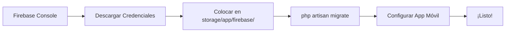
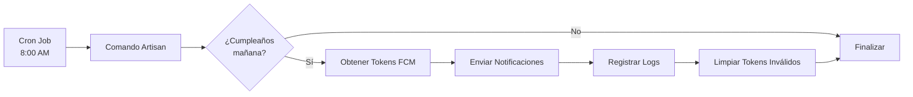

# 🔥 Firebase Cloud Messaging - Índice de Documentación

## 📚 Documentación Disponible

Este directorio contiene toda la documentación necesaria para trabajar con Firebase Cloud Messaging en CumpleApp.

### 📖 Guías Principales

| Documento | Descripción | Cuándo Usarlo |
|-----------|-------------|---------------|
| **[FIREBASE_SETUP.md](FIREBASE_SETUP.md)** | 📘 Guía completa de configuración paso a paso | **Primera vez** que configuras Firebase |
| **[INTEGRACION_FIREBASE_RESUMEN.md](INTEGRACION_FIREBASE_RESUMEN.md)** | 📊 Resumen del estado de implementación | Ver qué está hecho y qué falta |
| **[COMANDOS_FIREBASE.md](COMANDOS_FIREBASE.md)** | 💻 Comandos útiles y ejemplos prácticos | Uso diario, pruebas y troubleshooting |
| **[storage/app/firebase/README.md](storage/app/firebase/README.md)** | 🔐 Instrucciones para credenciales | Configurar el archivo de credenciales |

### 🚀 Inicio Rápido (Quick Start)

#### 1️⃣ Si es tu primera vez:

```bash
# 1. Descargar credenciales de Firebase Console
# 2. Colocar en: storage/app/firebase/firebase-credentials.json
# 3. Ejecutar migración
php artisan migrate

# 4. Probar
php artisan birthdays:send-notifications
```

**Ver guía completa:** [FIREBASE_SETUP.md](FIREBASE_SETUP.md)

#### 2️⃣ Si ya está configurado:

```bash
# Enviar notificaciones manualmente
php artisan birthdays:send-notifications

# Ver tokens registrados
php artisan tinker
>>> DB::table('fcm_tokens')->get();

# Ver logs
tail -f storage/logs/laravel.log | grep Firebase
```

**Ver más comandos:** [COMANDOS_FIREBASE.md](COMANDOS_FIREBASE.md)

---

## 🎯 Flujo de Trabajo

### Configuración Inicial (Una sola vez)



### Flujo de Notificaciones (Automático)



---

## 📁 Estructura de Archivos Firebase

```
CumpleApp/
│
├── 📄 FIREBASE_SETUP.md                    # Guía completa de configuración
├── 📄 INTEGRACION_FIREBASE_RESUMEN.md      # Estado de implementación
├── 📄 COMANDOS_FIREBASE.md                 # Comandos útiles
├── 📄 FIREBASE_README.md                   # Este archivo (índice)
│
├── app/
│   ├── Console/
│   │   ├── Commands/
│   │   │   └── 🔔 SendBirthdayNotifications.php    # Comando para enviar notificaciones
│   │   └── Kernel.php                               # Cron job configurado (8:00 AM)
│   │
│   ├── Http/
│   │   └── Controllers/
│   │       └── Api/
│   │           └── 🎮 FcmTokenController.php        # API para tokens FCM
│   │
│   └── Services/
│       └── 🔥 FirebaseNotificationService.php       # Servicio principal de Firebase
│
├── database/
│   └── migrations/
│       └── 🗄️ 2025_12_22_105453_create_fcm_tokens_table.php
│
├── routes/
│   └── api.php                              # Rutas: POST /fcm-token, DELETE /fcm-token
│
└── storage/
    └── app/
        └── firebase/
            ├── 🔐 firebase-credentials.json          # TUS CREDENCIALES (no en Git)
            ├── 📋 firebase-credentials.example.json  # Ejemplo de estructura
            ├── .gitignore                            # Protege credenciales
            └── README.md                             # Instrucciones del directorio
```

---

## 🔧 Componentes Implementados

### ✅ Backend (Laravel)

- [x] **Paquete Firebase Admin SDK** instalado
- [x] **Migración** de tabla `fcm_tokens`
- [x] **Controlador API** para gestionar tokens
- [x] **Servicio Firebase** para enviar notificaciones
- [x] **Comando Artisan** para notificaciones automáticas
- [x] **Cron Job** configurado (8:00 AM diario)
- [x] **Rutas API** configuradas
- [x] **Documentación** completa

### ⚠️ Pendiente

- [ ] **Credenciales Firebase** en `storage/app/firebase/firebase-credentials.json`
- [ ] **Configurar App Móvil** (React Native + Firebase)
- [ ] **Prueba End-to-End** desde app hasta notificación

---

## 🛠️ APIs Disponibles

### POST `/api/v1/fcm-token`

Registra o actualiza un token FCM.

**Request:**
```json
{
  "token": "fcm-token-del-dispositivo",
  "device_type": "android",
  "familiar_id": 1
}
```

**Response:**
```json
{
  "success": true,
  "message": "Token guardado correctamente"
}
```

### DELETE `/api/v1/fcm-token`

Elimina un token FCM.

**Request:**
```json
{
  "token": "fcm-token-del-dispositivo"
}
```

**Response:**
```json
{
  "success": true,
  "message": "Token eliminado correctamente"
}
```

---

## 🎯 Casos de Uso

### 1. Usuario Abre la App por Primera Vez

```typescript
// En React Native
const token = await messaging().getToken();
await axios.post('https://api.cumpleapp.com/api/v1/fcm-token', {
  token: token,
  device_type: 'android',
});
```

### 2. Sistema Envía Notificaciones Automáticas

```bash
# Cron ejecuta todos los días a las 8:00 AM
php artisan birthdays:send-notifications

# El comando:
# 1. Busca cumpleaños de mañana
# 2. Obtiene todos los tokens FCM
# 3. Envía notificación a cada dispositivo
# 4. Registra resultados en logs
```

### 3. Desarrollador Prueba Notificación

```bash
php artisan tinker
```

```php
use App\Services\FirebaseNotificationService;

$service = new FirebaseNotificationService();
$token = DB::table('fcm_tokens')->first()->token;
$service->sendToToken($token, 'Juan Pérez', '25');
```

### 4. Limpieza de Tokens Antiguos

```php
// Eliminar tokens no usados en 30 días
DB::table('fcm_tokens')
    ->where('last_used_at', '<', now()->subDays(30))
    ->delete();
```

---

## 📊 Monitoreo

### Ver Estadísticas

```bash
php artisan tinker
```

```php
// Total de tokens
DB::table('fcm_tokens')->count();

// Tokens por dispositivo
DB::table('fcm_tokens')
    ->select('device_type', DB::raw('COUNT(*) as total'))
    ->groupBy('device_type')
    ->get();

// Tokens activos (última semana)
DB::table('fcm_tokens')
    ->where('last_used_at', '>', now()->subDays(7))
    ->count();
```

### Ver Logs

```bash
# Logs en tiempo real
tail -f storage/logs/laravel.log | grep Firebase

# Buscar errores
grep "Error" storage/logs/laravel.log | grep Firebase

# Ver últimos 50 logs
tail -n 50 storage/logs/laravel.log
```

---

## 🐛 Solución Rápida de Problemas

| Problema | Solución Rápida |
|----------|-----------------|
| ❌ "Credenciales no configuradas" | Descargar desde Firebase Console y colocar en `storage/app/firebase/` |
| ❌ "Permission denied" | `chmod -R 775 storage/app/firebase` (Linux/Mac) |
| ❌ "Invalid credentials" | Volver a descargar credenciales desde Firebase Console |
| ⚠️ No se reciben notificaciones | Verificar token en BD, permisos de app, credenciales |
| ⚠️ Tokens duplicados | Ver [COMANDOS_FIREBASE.md](COMANDOS_FIREBASE.md) → "Verificar Integridad" |

**Ver guía completa:** [FIREBASE_SETUP.md](FIREBASE_SETUP.md) → Sección "Solución de Problemas"

---

## 📖 Aprende Más

### Documentación Oficial

- [Firebase Console](https://console.firebase.google.com/)
- [Firebase Admin SDK](https://firebase.google.com/docs/admin/setup)
- [Kreait Firebase PHP](https://firebase-php.readthedocs.io/)
- [React Native Firebase](https://rnfirebase.io/)

### Documentación del Proyecto

- [README Principal](README.md)
- [Estructura del Proyecto](ESTRUCTURA_PROYECTO.md)
- [Guía de Autenticación](GUIA_AUTENTICACION.md)
- [Comandos Artisan](GUIA_COMANDOS_ARTISAN.md)

---

## ✅ Checklist Rápido

### Para Desarrolladores

- [ ] Leer `FIREBASE_SETUP.md` completo
- [ ] Descargar credenciales de Firebase Console
- [ ] Colocar credenciales en `storage/app/firebase/firebase-credentials.json`
- [ ] Ejecutar `php artisan migrate`
- [ ] Probar con `php artisan birthdays:send-notifications`
- [ ] Configurar app móvil (si aplica)
- [ ] Hacer prueba end-to-end

### Para Producción

- [ ] Credenciales en el servidor
- [ ] Permisos del directorio correctos
- [ ] Migración ejecutada
- [ ] Cron job configurado
- [ ] Prueba de envío exitosa
- [ ] Monitoreo de logs activo

---

## 🎓 Mejores Prácticas

1. **Seguridad:**
   - ✅ Nunca subir credenciales al repositorio
   - ✅ Usar variables de entorno en producción
   - ✅ Rotar credenciales periódicamente

2. **Performance:**
   - ✅ Limpiar tokens antiguos mensualmente
   - ✅ Optimizar consultas con índices
   - ✅ Usar eager loading cuando sea posible

3. **Confiabilidad:**
   - ✅ Monitorear logs diariamente
   - ✅ Configurar alertas para errores
   - ✅ Hacer backups de la base de datos

4. **Testing:**
   - ✅ Probar notificaciones en desarrollo
   - ✅ Usar tokens de prueba
   - ✅ Verificar en diferentes dispositivos

---

## 💡 Tips

- 💡 El comando `birthdays:send-notifications` es **idempotente**: puedes ejecutarlo múltiples veces sin problemas
- 💡 Los tokens inválidos se eliminan **automáticamente** al intentar enviar
- 💡 Puedes enviar notificaciones **personalizadas** usando `sendCustomNotification()`
- 💡 Los tokens pueden asociarse a **familiares específicos** para notificaciones dirigidas
- 💡 El campo `last_used_at` te permite identificar **dispositivos activos**

---

## 🆘 ¿Necesitas Ayuda?

1. **Busca en los documentos:**
   - [FIREBASE_SETUP.md](FIREBASE_SETUP.md) → Configuración completa
   - [COMANDOS_FIREBASE.md](COMANDOS_FIREBASE.md) → Comandos y ejemplos
   - [INTEGRACION_FIREBASE_RESUMEN.md](INTEGRACION_FIREBASE_RESUMEN.md) → Estado actual

2. **Revisa los logs:**
   ```bash
   tail -f storage/logs/laravel.log
   ```

3. **Prueba los comandos de debug:**
   ```bash
   php artisan tinker
   # Ver comandos en COMANDOS_FIREBASE.md
   ```

4. **Consulta la documentación oficial:**
   - [Firebase Docs](https://firebase.google.com/docs)
   - [Laravel Docs](https://laravel.com/docs)

---

**Versión:** 1.0  
**Última actualización:** 22 de diciembre de 2025  
**Estado:** ✅ Backend Completo - ⚠️ Requiere Configuración de Credenciales

---

**¡Bienvenido a Firebase Cloud Messaging en CumpleApp! 🎉**

